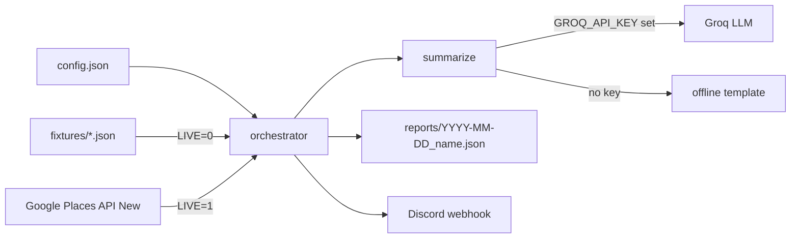

# automated-google-business-reports

> Weekly Google Places review snapshots, summarized by an LLM and pushed to a webhook — all on free tiers.


[](https://github.com/gokhanagarer/automated-google-business-reports/actions/workflows/test.yml)


## What it does

Pulls metadata and the most recent reviews for any place from the **Google Places API (New)**, summarizes the reputation with an LLM, drafts response copy for negative reviews, and posts a one-line digest to a Discord webhook. Designed to run as a scheduled job (cron, GitHub Actions, Task Scheduler) so a team gets a weekly pulse without anyone opening the console.

The interesting part is the **graceful degradation**: every external dependency (Places API, Groq LLM, Discord) is optional. The demo runs end-to-end against a bundled fixture with an offline template summarizer — no API keys, no network — so anyone reading the repo can `make demo` and see real output in 30 seconds.

## Quickstart

```bash
git clone https://github.com/gokhanagarer/automated-google-business-reports.git
cd automated-google-business-reports
make demo
```

You'll see a report written to `reports/YYYY-MM-DD_example_subject.json` with the metadata, reviews, an offline-template summary, and suggested replies for sub-4-star reviews.

## Going live

```bash
cp .env.example .env
# fill in GOOGLE_PLACES_API_KEY (and optionally GROQ_API_KEY, DISCORD_WEBHOOK_URL)
export LIVE=1
make demo
```

Edit `config.json` to add the places you actually want to track:

```json
{
  "subjects": [
    { "name": "Your Subject",   "place_id": "ChIJ..." },
    { "name": "Other Subject",  "place_id": "ChIJ..." }
  ],
  "tone": "professional and friendly"
}
```

## Architecture



## Configuration

| Env var | When required | Purpose |
|---|---|---|
| `LIVE` | always | `1` calls real APIs, `0`/unset uses bundled fixtures |
| `GOOGLE_PLACES_API_KEY` | `LIVE=1` | Places API (New) — [console](https://console.cloud.google.com/apis/library/places.googleapis.com) |
| `GROQ_API_KEY` | optional | Switches summarizer from offline template → llama-3.3-70b on Groq |
| `DISCORD_WEBHOOK_URL` | optional | Where the weekly digest is posted |
| `DEMO_FIXTURE` | optional | Override the bundled fixture filename in `fixtures/` |

## Project layout

```
.
├── src/
│   ├── places.py       # Places API client + fixture loader
│   ├── summarize.py    # Groq summarizer + offline-template fallback
│   ├── notify.py       # Discord webhook adapter
│   ├── main.py         # orchestrator
│   └── demo.py         # `make demo` entry point
├── tests/              # offline tests, no API keys needed
├── fixtures/           # recorded Places API responses for the demo
├── config.json         # which places to track + tone
├── .env.example
├── Makefile
└── README.md
```

## Tests

```bash
make test
```

Tests exercise the offline path (`_offline_summary`, full demo run, fixture loading) — they do not hit any external service.

## Scheduling

Any scheduler works. The simplest is GitHub Actions (`.github/workflows/weekly.yml`), Linux cron, or Windows Task Scheduler. The script is idempotent per day (output files are timestamped `YYYY-MM-DD_<slug>.json`).

## License

MIT — see [LICENSE](LICENSE).
