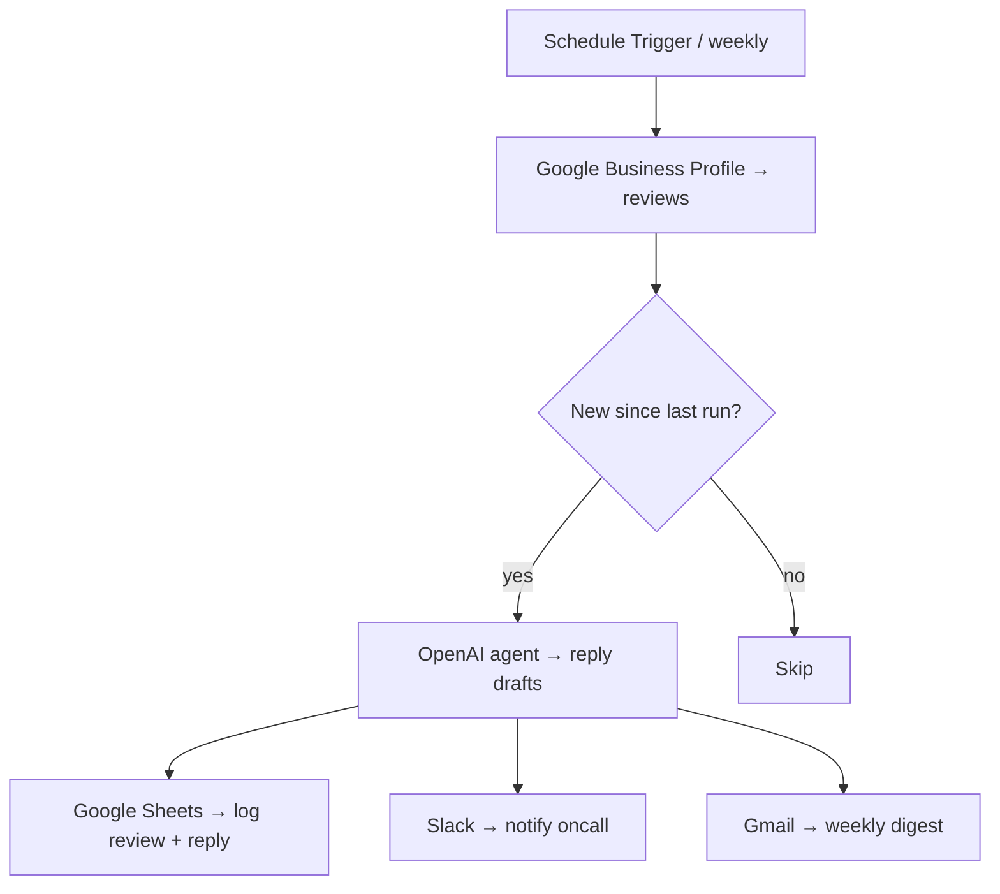

# n8n workflow — Google Business Reports

A drop-in n8n workflow that mirrors what `src/main.py` does, but inside the no-code automation tool. Useful if you already run n8n and want this pipeline alongside your other automations without writing Python.

The Python version is the canonical reference. The n8n workflow is a teaching example showing how the same logic looks when expressed as nodes.

---

## What it does



Workflow has **73 nodes** organised in four sections:

1. **Triggers** — `Schedule Trigger` (weekly) + a `Google Business Profile Trigger` (real-time new reviews)
2. **Fetch + classify** — pulls reviews, splits into current week / last week / 12-week / all-time buckets
3. **AI summary** — a LangChain agent (`@n8n/n8n-nodes-langchain.agent` + `lmChatOpenAi`) drafts reply suggestions
4. **Distribution** — writes to Google Sheets, posts to Slack, sends a weekly email via Gmail

---

## How to import

1. Open your n8n instance → **Workflows** → top-right `+` → **Import from file**
2. Pick `n8n/google-business-reports.json`
3. The workflow loads with **disconnected credentials** — every node that calls an external service will show ⚠️

You will see four placeholder values you must replace:
- `YOUR_GOOGLE_SHEET_ID` — your reviews log sheet
- `YOUR_RESOURCE_ID` — a few `value` fields the original workflow had baked in (LLM model id, sheet name, etc.); n8n will prompt you on each
- `YOUR_CREDENTIAL_ID` — every credential reference (Google, OpenAI, Slack, Gmail) needs to be re-bound
- `team@example.com` — notification email recipients

---

## Connecting credentials

For each ⚠️ node, click into it and re-select the credential from the dropdown. If the credential doesn't exist yet, **Create New**:

| Node type                 | Credential to connect          | Where to find it                                              |
|---------------------------|--------------------------------|----------------------------------------------------------------|
| `googleBusinessProfile`   | Google OAuth2 (Business Profile API) | https://console.cloud.google.com → enable Business Profile API |
| `googleSheets`            | Google OAuth2 (Sheets scope)   | Same Cloud Console project                                    |
| `lmChatOpenAi`            | OpenAI API                     | https://platform.openai.com/api-keys                          |
| `slack`                   | Slack webhook URL              | Channel → Integrations → Webhooks                             |
| `gmail`                   | Google OAuth2 (Gmail scope)    | Same Cloud Console project                                    |

---

## Configuration data

Open the **`Business Configuration`** node (a Set node early in the flow) and replace:

```js
{
  business_name:     "Your Business Name",
  notification_tone: "professional and friendly",
  response_max_words: 80
}
```

Open **`Google Sheet — Reviews`** and:
1. Create a sheet with a tab named `Reviews`
2. First-row headers: `Date | Source | Rating | Reviewer | Review | AI Response | Review ID`
3. Paste the sheet ID into the node's `documentId` field

---

## Running it

- **Manual test** — click the Schedule Trigger node → **Execute Node** to fire a single run
- **Activate** — top-right toggle → switches to scheduled execution
- **Watch the executions tab** for the first real run; expect ~20–40 s end-to-end depending on review count

---

## Node-by-node reference

The workflow's sticky notes document each section in the canvas. The five most interesting ones:

1. **`Schedule Trigger`** — cron-syntax under the hood; the workflow defaults to weekly Mondays
2. **`If — review is new`** — deduplicates against the `Review ID` column already in your sheet; prevents double-posting
3. **`OpenAI Agent`** — uses `outputParserStructured` so the LLM returns JSON, not free text; downstream nodes parse `reply_draft` directly
4. **`Code — sentiment bucketing`** — pure JS in n8n's `Code` node; classifies each review as positive / neutral / negative based on rating
5. **`Merge — weekly digest`** — collects all reviews from the schedule period and the AI-classifies them before the email

---

## Cost notes

- **Google Business Profile API** — free, ~150 req/day
- **OpenAI** — depends on volume; `gpt-4o-mini` keeps a 50-review/week digest under $0.05/month
- **Slack / Gmail / Sheets** — free for personal use

---

## When to use the n8n version vs the Python script

| Choose **n8n** when | Choose **Python `src/main.py`** when |
|---|---|
| You already run n8n and want everything in one canvas | You don't run n8n and don't want to operate it |
| Reviewers / non-developers will modify the prompt | You want to integrate the pipeline into your own code |
| You want visual execution logs out of the box | You prefer git-versioned configuration |
| You only run it occasionally and don't want to pay for compute | You want to schedule via cron / GitHub Actions for free |
